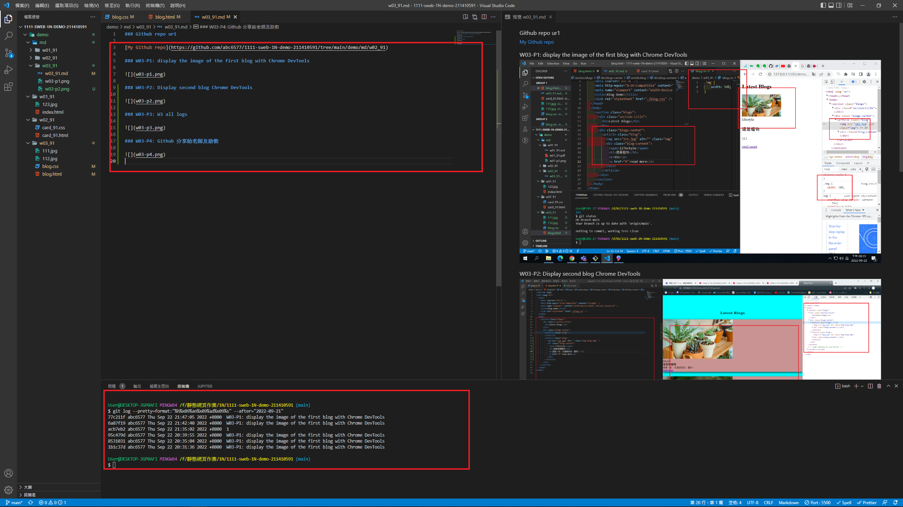

### Github repo ur1

[My Github repo](https://github.com/abc6577/1111-sweb-1N-demo-211410591/tree/main/demo/md/w02_91)

### W03-P1: display the image of the first blog with Chrome DevTools


### W03-P2: Display second blog Chrome DevTools


### W03-P3: W3 all logs



```
$ git log --pretty=format:"%h%x09%an%x09%ad%x09%s" --after="2022-09-22"
4b772bf abc6577 Sat Sep 24 00:18:20 2022 +0800  W3 all logs
77c211f abc6577 Thu Sep 22 21:47:05 2022 +0800  W03-P1: display the image of the first blog with Chrome DevTools
6a87f19 abc6577 Thu Sep 22 21:42:40 2022 +0800  W03-P1: display the image of the first blog with Chrome DevTools
acb7eb2 abc6577 Thu Sep 22 21:35:02 2022 +0800  1
95c479d abc6577 Thu Sep 22 20:39:55 2022 +0800  W03-P1: display the image of the first blog with Chrome DevTools
8531031 abc6577 Thu Sep 22 20:35:04 2022 +0800  W03-P1: display the image of the first blog with Chrome DevTools
1b1c37d abc6577 Thu Sep 22 20:31:36 2022 +0800  W03-P1: display the image of the first blog with Chrome DevTools
```

### W03-P4: Github 分享給老師及助教


