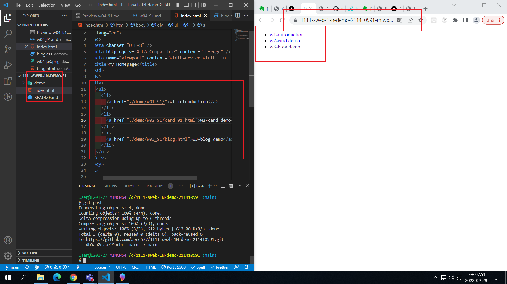
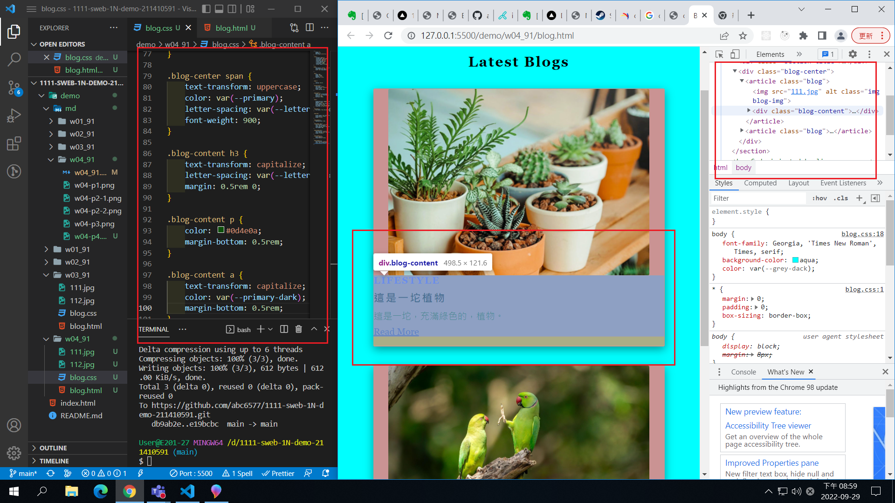
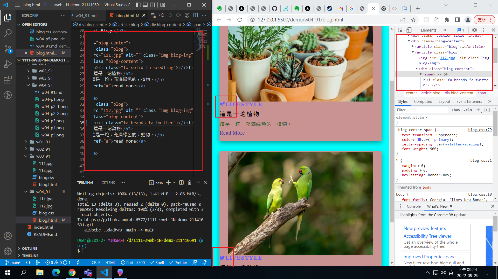
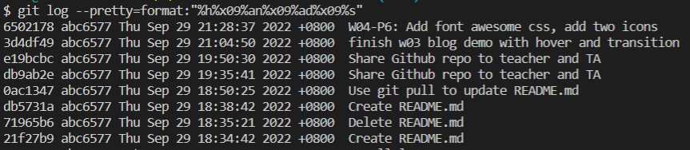

### Github repo ur1

[My Github repo](https://github.com/abc6577/1111-sweb-1N-demo-211410591/tree/main/demo/md/w02_91)

### W04-P1: Use git pull to update README.md


### W04-P2: Deploy Github to Vercel


### W04-P3: Share Github repo to teacher and TA


### W04-P4: add index.html as homepage, and show in Vercel



### W04-P5: finish w03 blog demo with hover and transition



### W04-P6: Add font awesome css, add two icons



### W04-logs: W4 all logs

```
$ git log --pretty=format:"%h%x09%an%x09%ad%x09%s"
6502178 abc6577 Thu Sep 29 21:28:37 2022 +0800  W04-P6: Add font awesome css, add two icons
3d4df49 abc6577 Thu Sep 29 21:04:50 2022 +0800  finish w03 blog demo with hover and transition
e19bcbc abc6577 Thu Sep 29 19:50:30 2022 +0800  Share Github repo to teacher and TA
db9ab2e abc6577 Thu Sep 29 19:35:41 2022 +0800  Share Github repo to teacher and TA
0ac1347 abc6577 Thu Sep 29 18:50:25 2022 +0800  Use git pull to update README.md
db5731a abc6577 Thu Sep 29 18:38:42 2022 +0800  Create README.md
71965b6 abc6577 Thu Sep 29 18:35:21 2022 +0800  Delete README.md
21f27b9 abc6577 Thu Sep 29 18:34:42 2022 +0800  Create README.md
```


