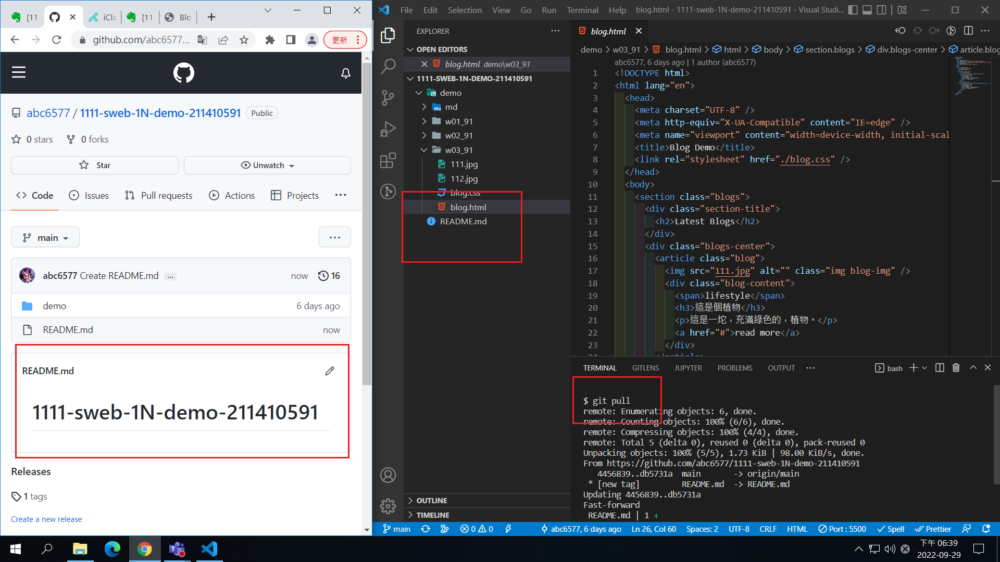
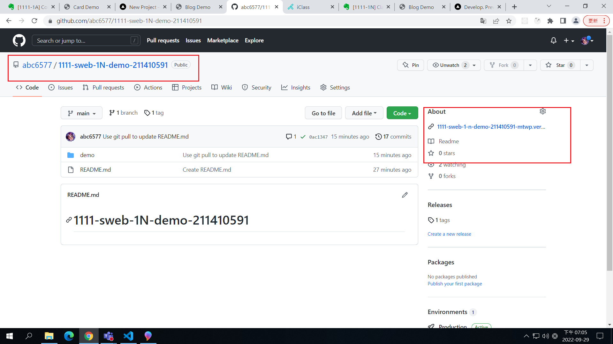
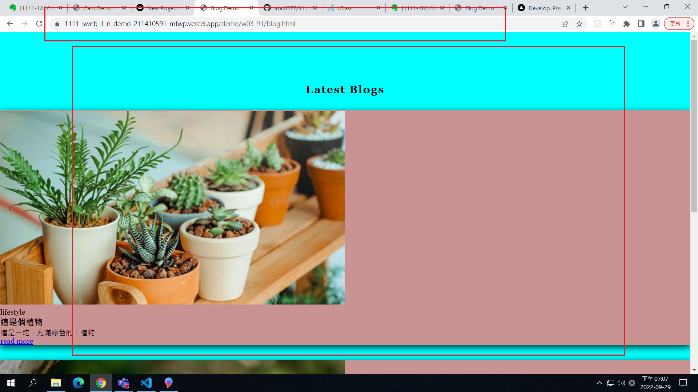
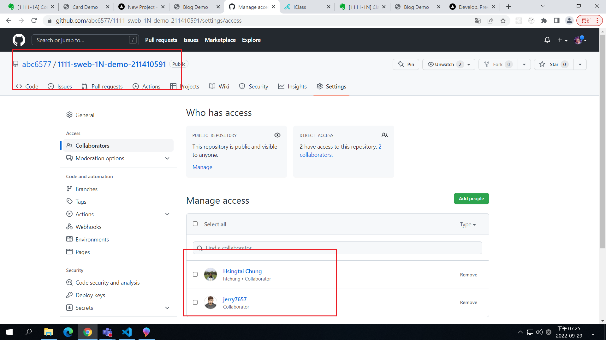

### Github repo ur1

[My Github repo](https://github.com/abc6577/1111-sweb-1N-demo-211410591/tree/main/demo/md/w02_91)

### W04-P1: Use git pull to update README.md

### W04-P2: Deploy Github to Vercel

### W04-P3: Share Github repo to teacher and TA

