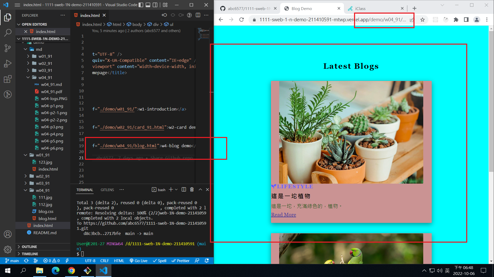
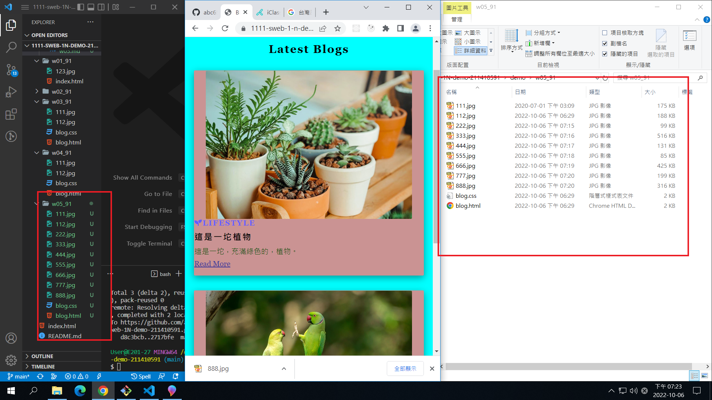
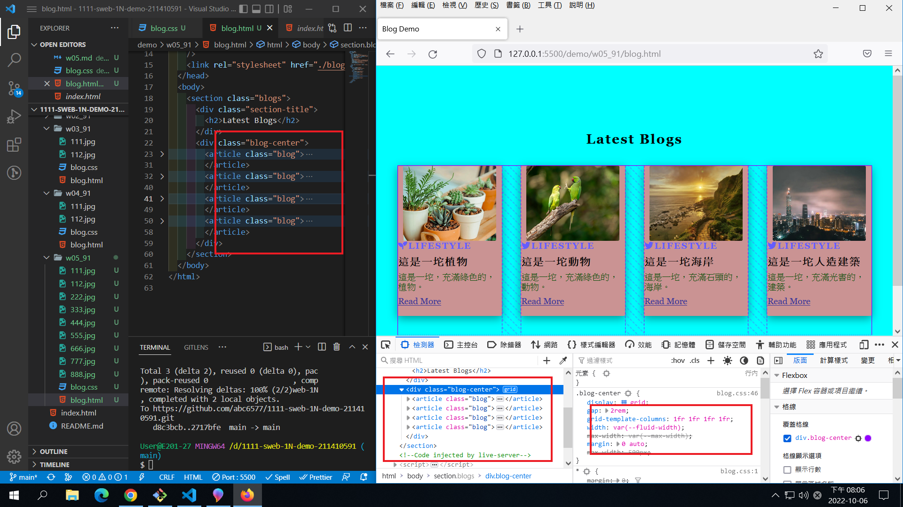
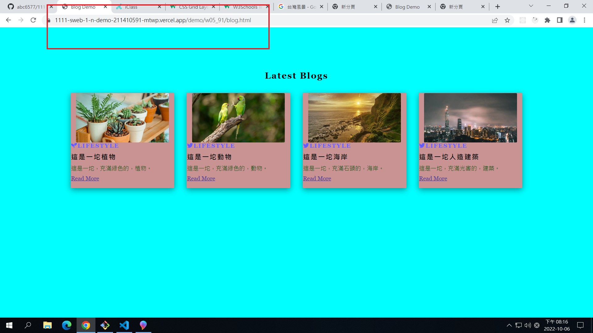
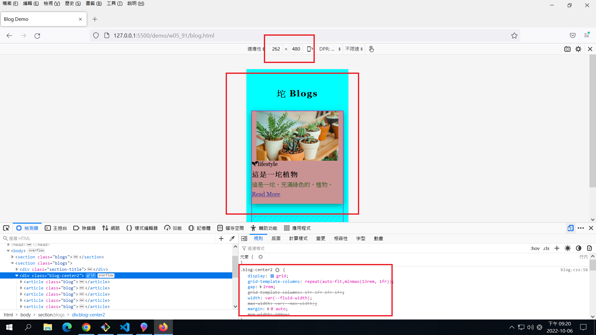
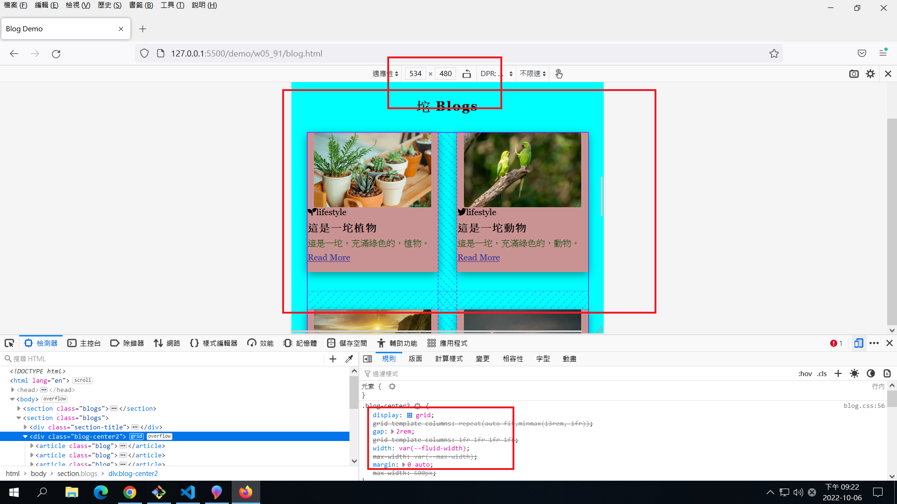
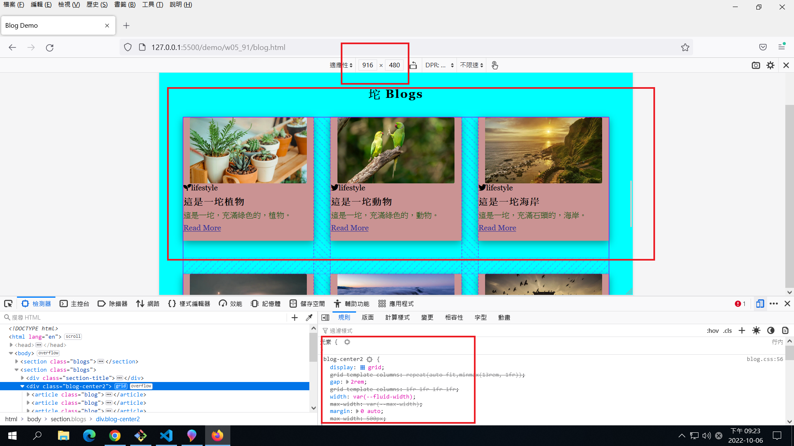
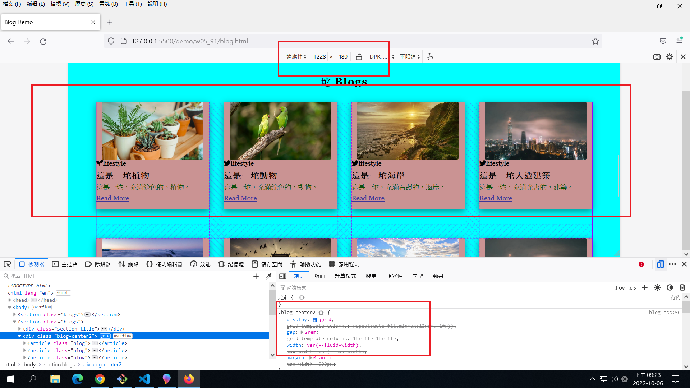
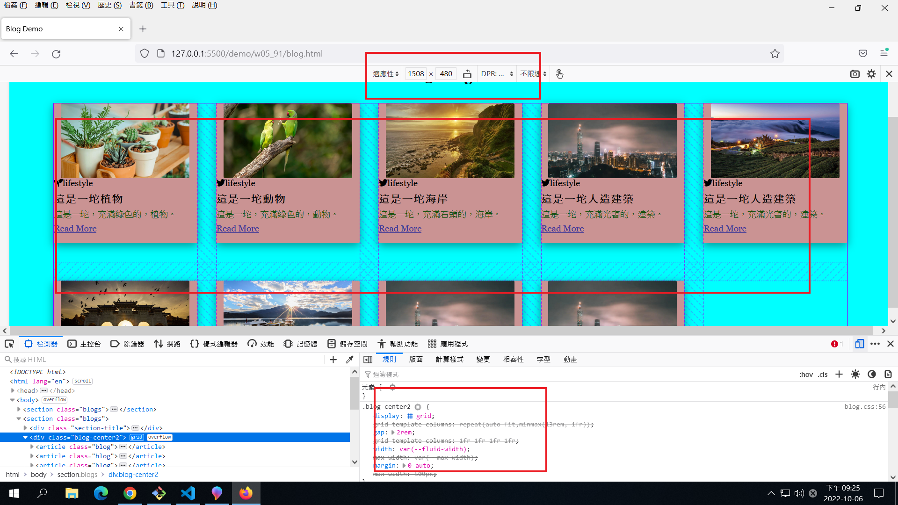

### W05-P1:add w04 link in index.html



### W05-P2: get 9 photo using small sizes



### W05-P3:Use grid to show 4 photos in a row



### W05-P4:Add w05 link in index.html,and show it in Vercel



### W05-P5: Using css grid with minmax to display 9 photos











### W05-logs: W5 all logs


```
$ git log --pretty=format:"%h%x09%an%x09%ad%x09%s" --after="2022-10-5"
518be6c abc6577 Thu Oct 6 21:35:24 2022 +0800   W05-logs: W5 all logs
848310b abc6577 Thu Oct 6 20:33:34 2022 +0800   W05-P4:Add w05 link in index.html,and show it in Vercel
63ca575 abc6577 Thu Oct 6 20:21:11 2022 +0800   W05-P4:Add w05 link in index.html,and show it in Vercel
9735b3c abc6577 Thu Oct 6 20:13:05 2022 +0800   W05-P3:Use grid to show 4 photos in a row
2717bfe abc6577 Thu Oct 6 18:43:31 2022 +0800   W04-P6: Add font awesome css, add two icons
d8c3bcb abc6577 Thu Oct 6 18:39:09 2022 +0800   W04-P6: Add font awesom:
```
