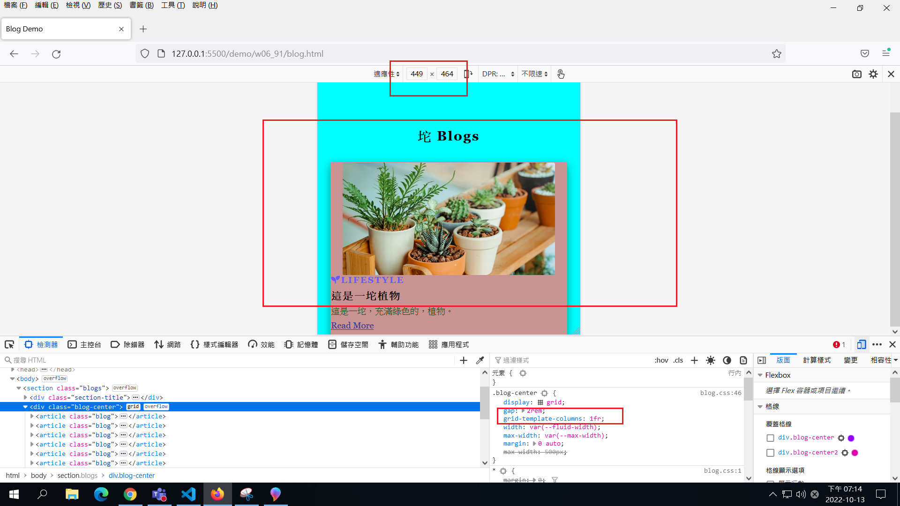
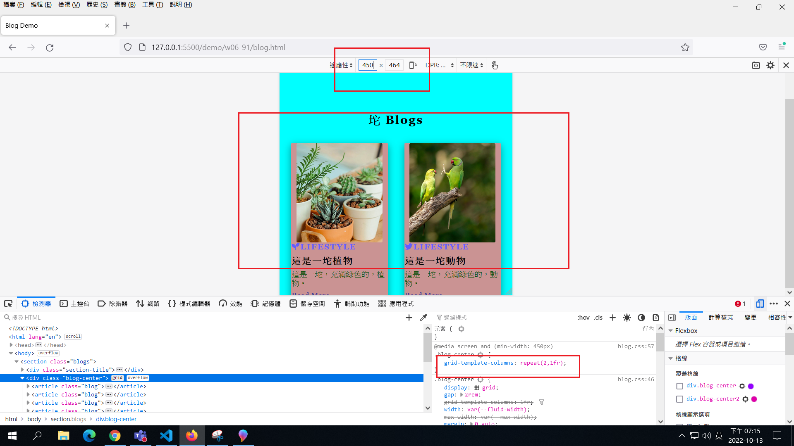
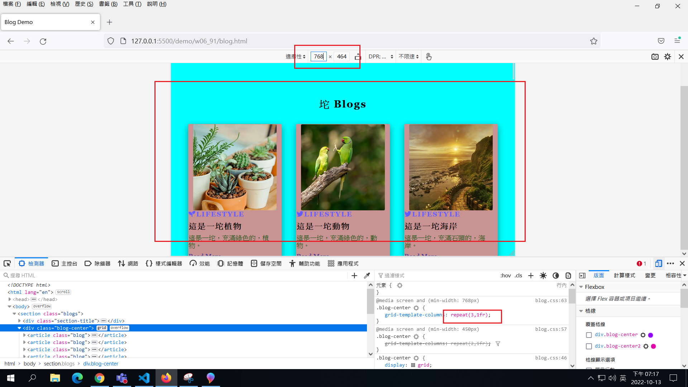
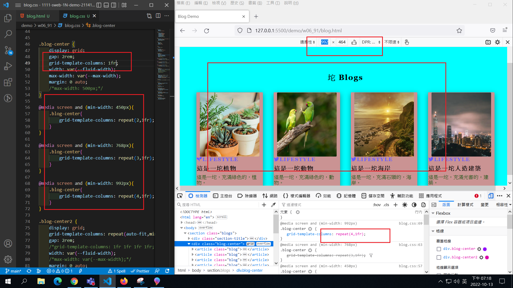
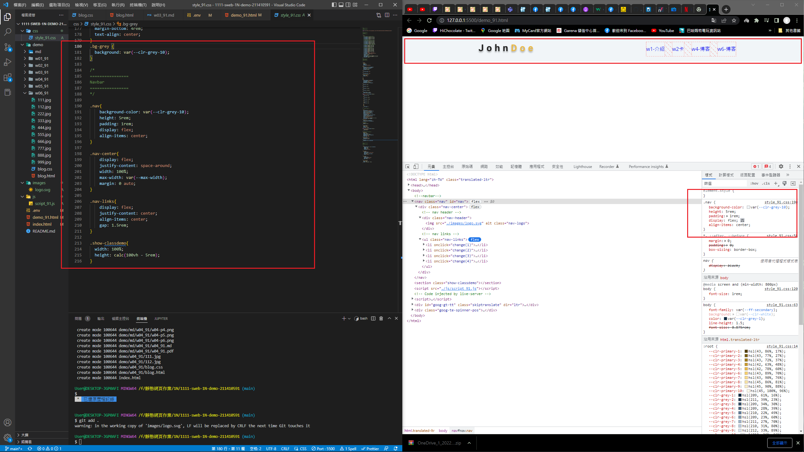
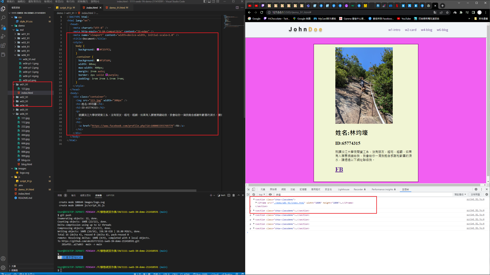
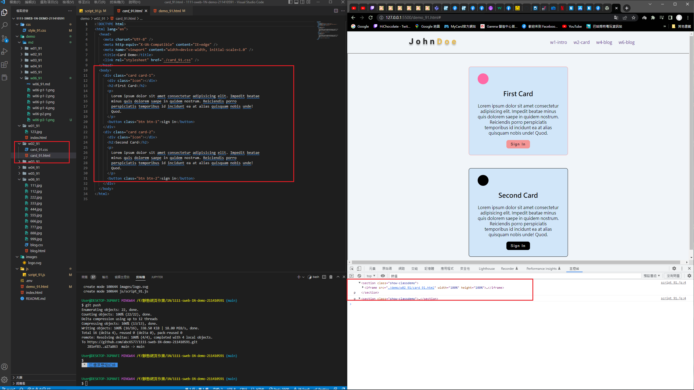
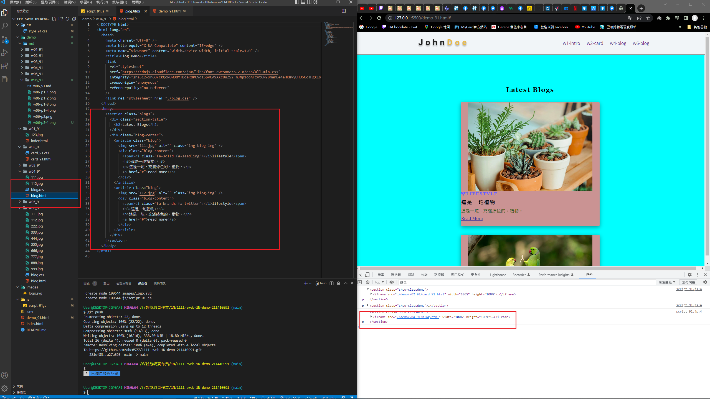
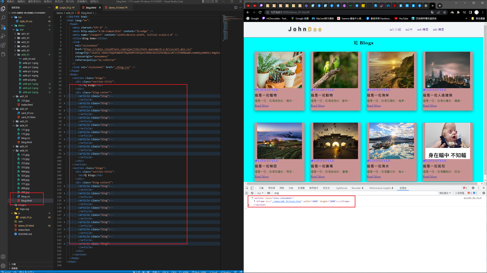
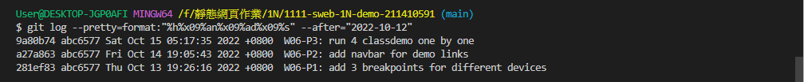

### W06-P1: add 3 breakpoints for different devices









### W06-P2: add navbar for demo links



### W06-P3: run 4 classdemo one by one









### W06-logs: W4 all logs



```
$ git log --pretty=format:"%h%x09%an%x09%ad%x09%s" --after="2022-10-12"
9a80b74 abc6577 Sat Oct 15 05:17:35 2022 +0800  W06-P3: run 4 classdemo one by one
a27a863 abc6577 Fri Oct 14 19:05:43 2022 +0800  W06-P2: add navbar for demo links
281ef83 abc6577 Thu Oct 13 19:26:16 2022 +0800  W06-P1: add 3 breakpoints for different devices

```