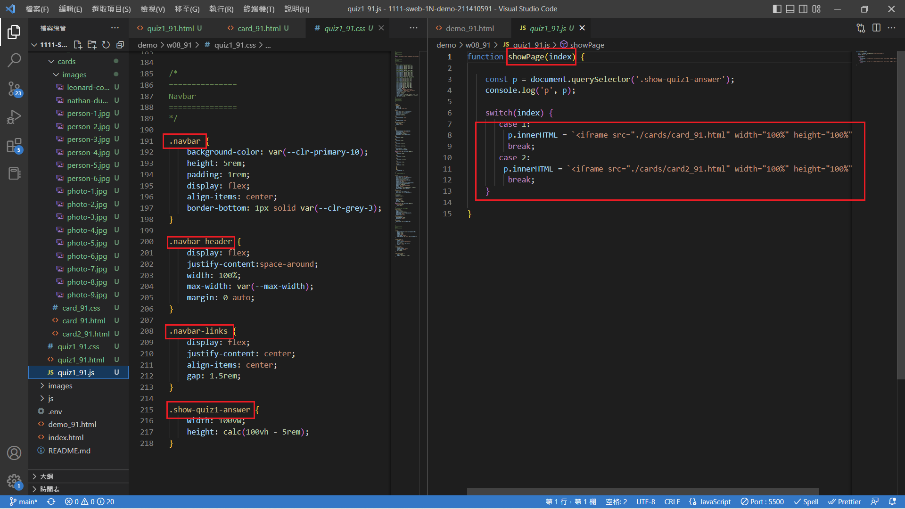
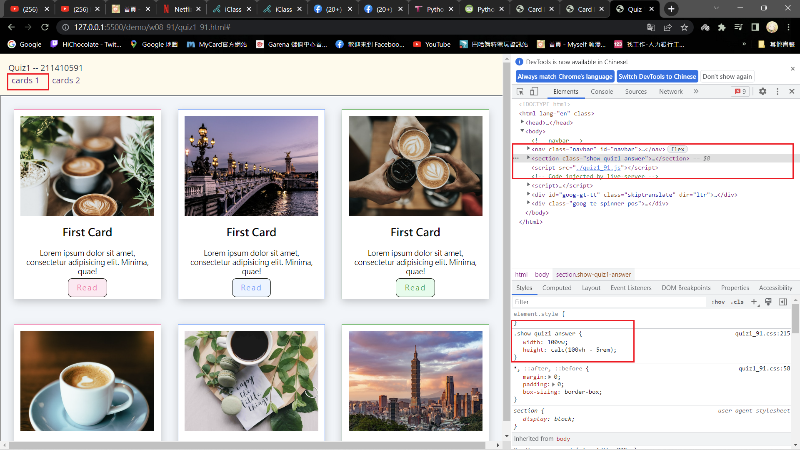
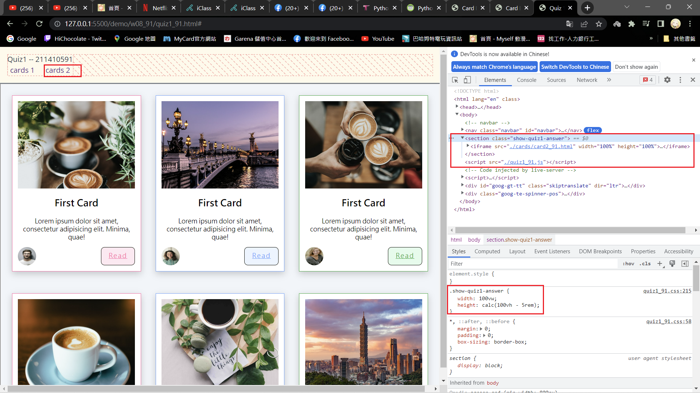
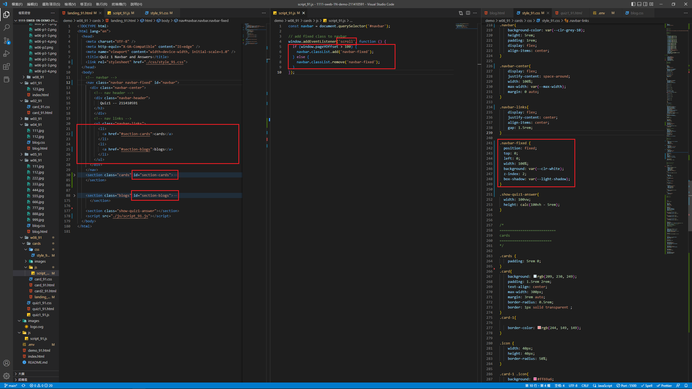
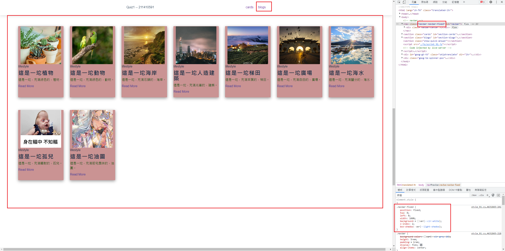
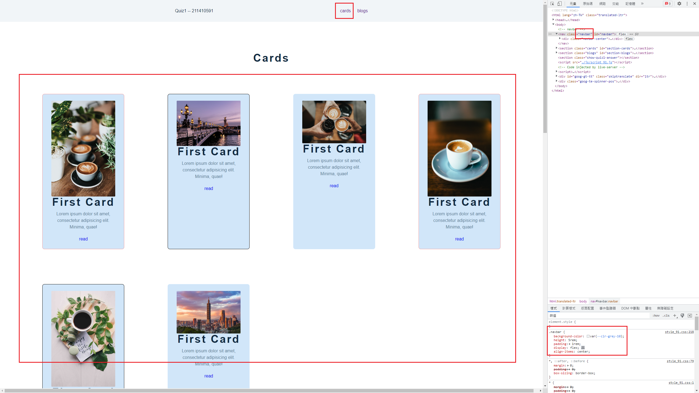
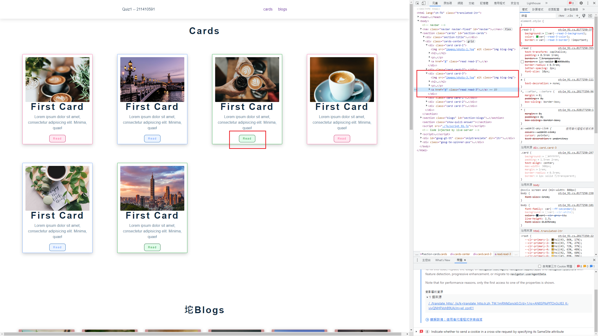
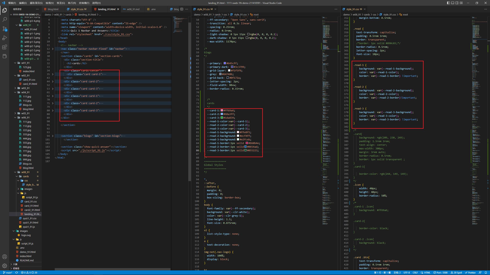
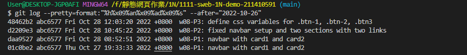

### w08-P1: navbar with card1 and card2










### w08-P2: fixed navbar setup and two sections with two links







### w08-P3: define css variables for .btn-1, .btn-2, .btn3





### w08-P4: w08 logs 

```
$ git log --pretty=format:"%h%x09%an%x09%ad%x09%s" --after="2022-10-26"
48462b2 abc6577 Fri Oct 28 12:03:20 2022 +0800  w08-P3: define css variables for .btn-1, .btn-2, .btn3
d2209e3 abc6577 Fri Oct 28 10:45:22 2022 +0800  w08-P2: fixed navbar setup and two sections with two links
daa9527 abc6577 Fri Oct 28 08:52:51 2022 +0800  w08-P1: navbar with card1 and card2
01c0be2 abc6577 Thu Oct 27 19:33:33 2022 +0800  w08-P1: navbar with card1 and card2
```

