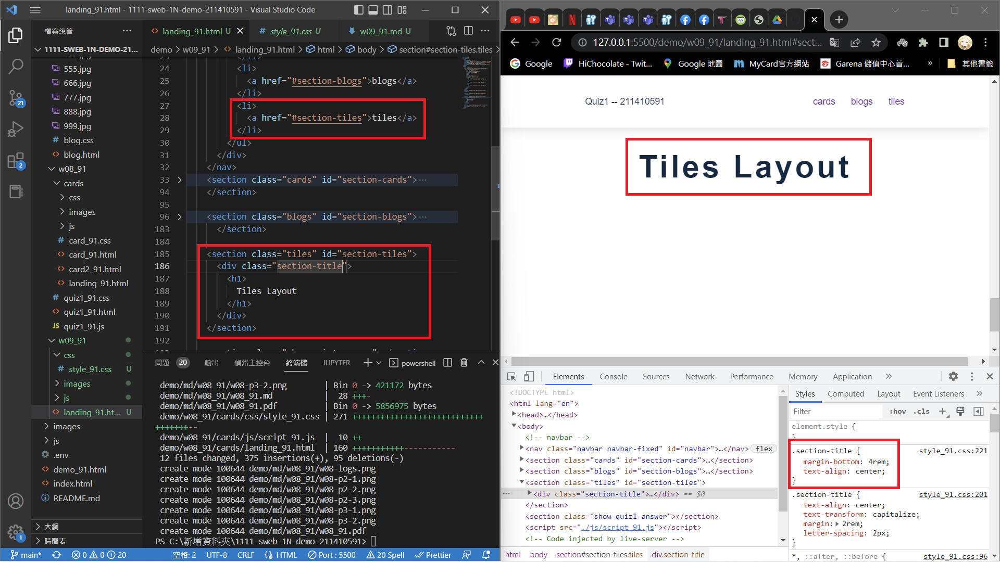
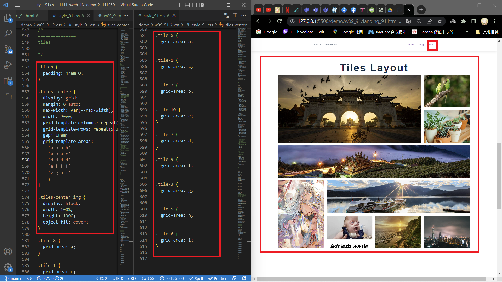
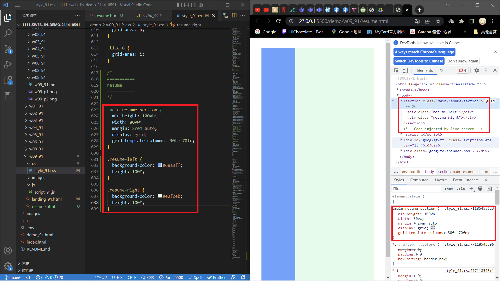
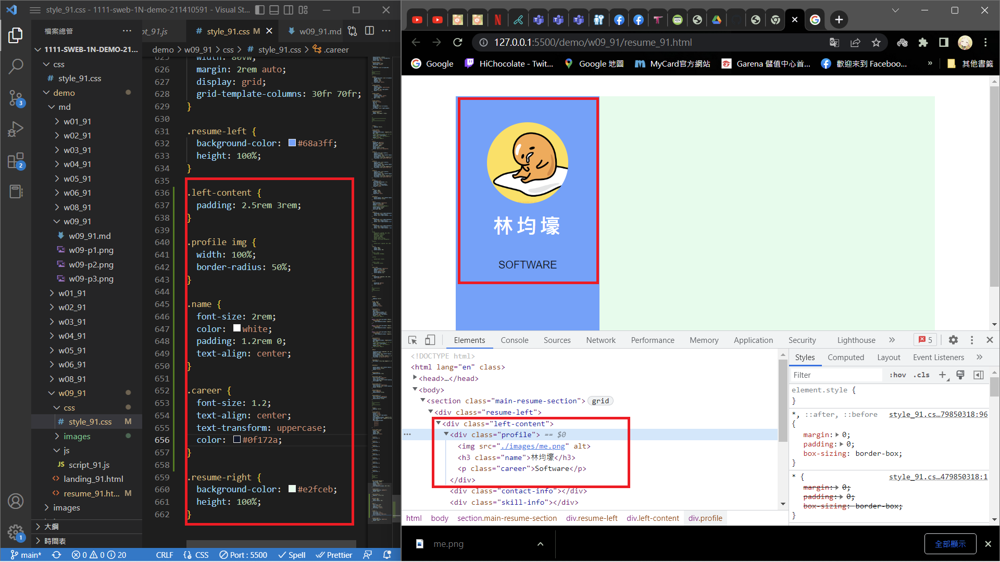
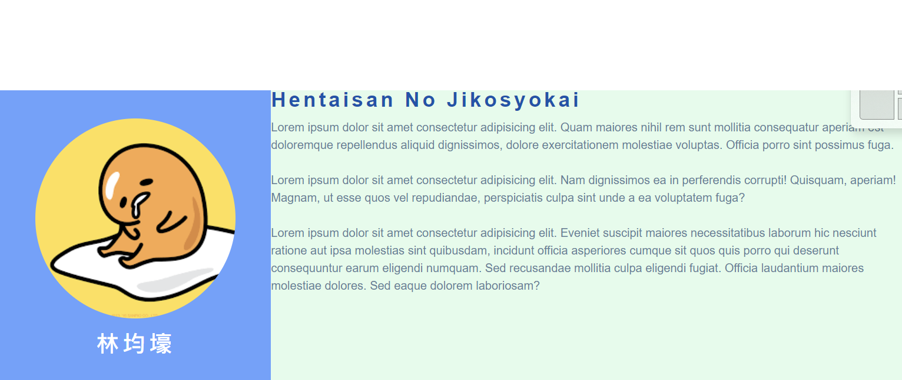

### w09-P1: setup tiles menu item with section id



### w09-P2: Show tiles layout of 9 photos



### w09-P3: Resume, show resume-left and resume-right with ratio 30:70



### w09-P4: Resume, show .profile with photo, name, career



### w09-P5: Resume, show about info on resume-right section



### w09-logs: w09 logs
```
git log --pretty=format:"%h%x09%an%x09%ad%x09%s" --after="2022-11-02"  
c73e7b9 abc6577 Thu Nov 3 21:19:04 2022 +0800   w09-P5: Resume, show about info on resume-right section
411cbc6 abc6577 Thu Nov 3 20:21:17 2022 +0800   w09-P3: Resume, show resume-left and resume-right with ratio 30:70
f8c89bf abc6577 Thu Nov 3 19:36:52 2022 +0800   w09-P2: Show tiles layout of 9 photos
```