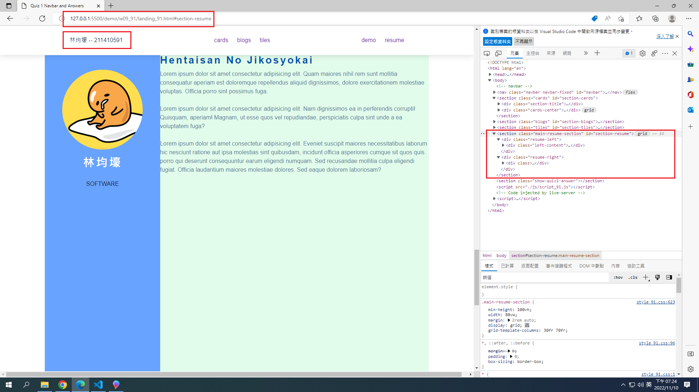
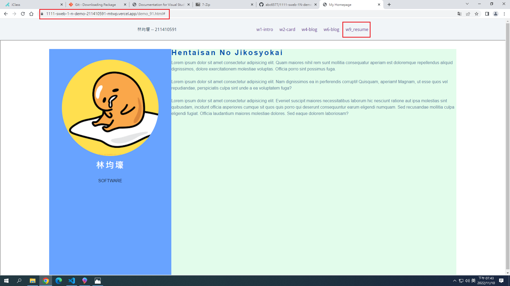
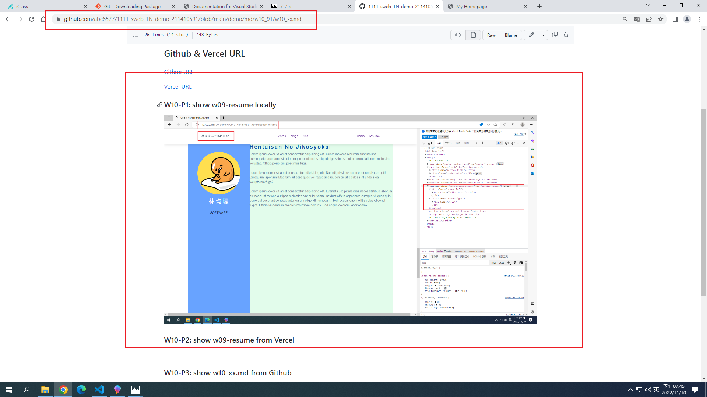
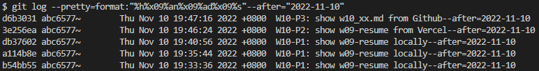

## Github & Vercel URL

[Github URL](https://github.com/htchung/1111-web-demo-id)

[Vercel URL](https://1111-web-demo-id-kd9e.vercel.app/)

### W10-P1: show w09-resume locally



### W10-P2: show w09-resume from Vercel



### W10-P3: show w10_xx.md from Github



### W10-logs: show all logs of Week 9



```
$ git log --pretty=format:"%h%x09%an%x09%ad%x09%s" --after="2022-11-10"
d6b3031 abc6577~        Thu Nov 10 19:47:16 2022 +0800  W10-P3: show w10_xx.md from Github--after=2022-11-10
3e256ea abc6577~        Thu Nov 10 19:46:24 2022 +0800  W10-P2: show w09-resume from Vercel--after=2022-11-10
db37602 abc6577~        Thu Nov 10 19:40:56 2022 +0800  W10-P1: show w09-resume locally--after=2022-11-10
a114b8e abc6577~        Thu Nov 10 19:35:44 2022 +0800  W10-P1: show w09-resume locally--after=2022-11-10
b54bb55 abc6577~        Thu Nov 10 19:33:36 2022 +0800  W10-P1: show w09-resume locally--after=2022-11-10

```
