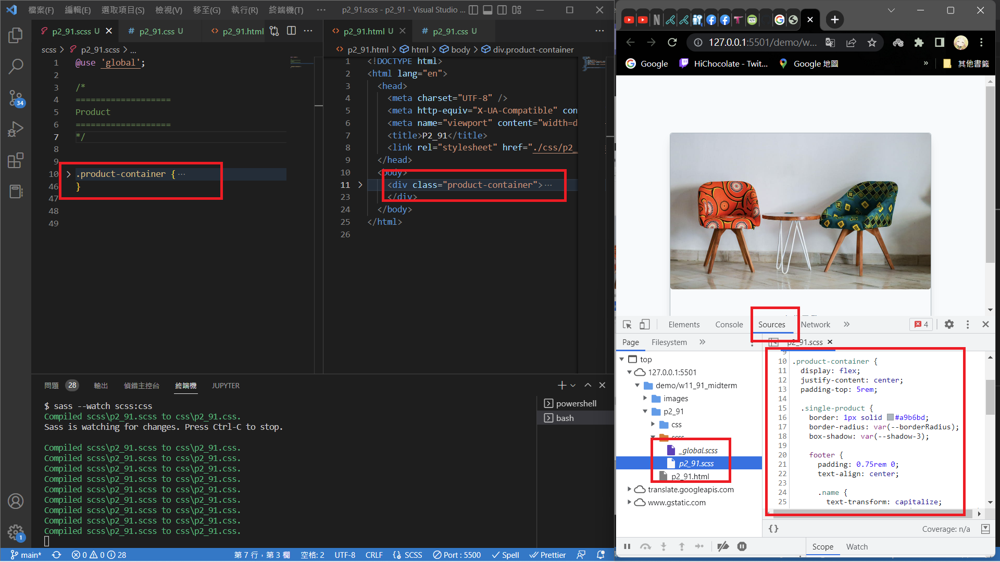
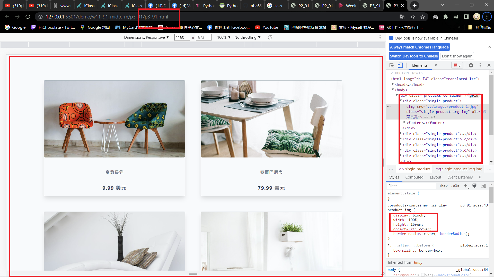
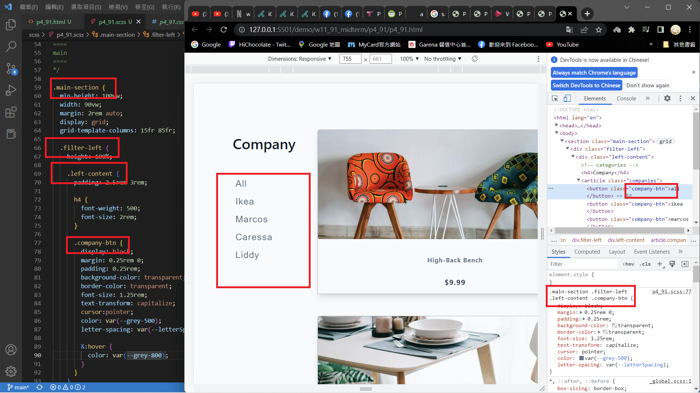
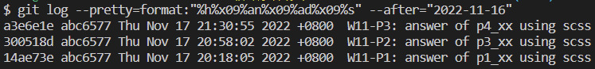

[My Github repo](https://github.com/abc6577/1111-sweb-1N-demo-211410591/tree/main/demo/md/w02_91)

### W11-P1: answer of p2_xx using scss



### W11-P2: answer of p3_xx using scss



### W11-P3: answer of p4_xx using scss



### w11-logs: w11 logs



```
$ git log --pretty=format:"%h%x09%an%x09%ad%x09%s" --after="2022-11-16"
a3e6e1e abc6577 Thu Nov 17 21:30:55 2022 +0800  W11-P3: answer of p4_xx using scss
300518d abc6577 Thu Nov 17 20:58:02 2022 +0800  W11-P2: answer of p3_xx using scss
14ae73e abc6577 Thu Nov 17 20:18:05 2022 +0800  W11-P1: answer of p1_xx using scss
```